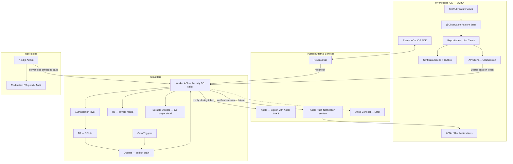

# My Miracles — Architecture

Native SwiftUI client, Cloudflare Workers backend. **Server-authoritative, offline-friendly.**
Not microservices. One Worker, one database, one boundary.



## The security model, and how it differs from an RLS backend

**D1 has no row-level security.** That single fact shapes everything else.

The iOS client holds no database credential and cannot issue a query. It sends HTTP
requests carrying a user session token, and the Worker decides — every time — whether that
account may see or change the row in question.

| | Postgres + RLS | Cloudflare D1 + Worker |
|---|---|---|
| Who talks to the database | The client, directly | Only the Worker |
| Where authorization lives | Database policies | Worker code, one layer |
| If the app layer has a bug | The database still refuses | **Nothing else refuses** |
| If a query is malformed | Policy still filters rows | Whatever the code says |
| Attack surface | Any table exposed to the Data API | The routes that exist |

Neither is strictly safer. RLS gives defence in depth; a Worker API gives a smaller, more
auditable surface where the client cannot compose its own queries. What matters is being
honest about which one you have: here, **a missing check has no backstop**, so the
adversarial matrix in [database.md](database.md#required-adversarial-tests) is not
optional polish. It is the security model.

Concretely:

- Every route resolves the caller to an account before touching D1.
- Visibility, blocks and ownership are decided in one shared authorization module, not
  re-implemented per route.
- A response is built from an explicit column list. No `select *` reaches a client.
- `post_authorship` is queried only to answer "does this account own this post?" and "what
  are my own posts?". It is never joined into a response another user can see.
- A refusal returns 403 and is a correct outcome, not a bug to route around (rule 6).

## Division of responsibility

**Ordinary reads and writes** are plain Worker routes against D1.

**Privileged or multi-step operations** run inside a single D1 transaction (`batch`) or a
Durable Object when serialization matters: answered-prayer conversion, moderation actions,
account deletion, RevenueCat webhook processing, and eventually money.

D1 supports batched statements that commit atomically, which is what
`prayer → answered → miracle` requires (rule 10). If an operation cannot be expressed as
one batch, it belongs in a Durable Object that owns the invariant.

## Client architecture

```text
MyMiracles/
├── App/            Entry point, root scene, composition root
├── Core/
│   ├── Analytics/       Event allowlist, redaction-safe by construction
│   ├── Authentication/  Session tokens, Sign in with Apple, Keychain
│   ├── Configuration/   Environment + API base URL; credential tripwire
│   ├── DesignSystem/    Tokens and shared components
│   ├── Networking/      APIClient, request types, error mapping
│   ├── Notifications/   APNs registration, categories, preferences
│   ├── Persistence/     SwiftData cache + pending-mutation outbox
│   └── Security/        Keychain, redaction, sensitive-value wrappers
├── Features/       One directory per feature
├── Models/         Shared domain types
└── Resources/      Assets, localization
```

There is no `Core/Database`. The client has no database — `Core/Persistence` holds a
SwiftData cache and outbox, which is never independent business truth (rule 3).

Layering, strictly one direction:

```text
View  →  @Observable FeatureModel  →  Repository (protocol)  →  APIClient  →  Worker
```

Views are dumb (rule 17). They render state and send intent.

Repositories are protocols so features can be tested against fakes:

```swift
protocol PostRepository {
    func create(_ draft: PostDraft) async throws(AppError) -> Post
    func post(id: UUID) async throws(AppError) -> Post
    func feed(after cursor: FeedCursor?) async throws(AppError) -> FeedPage
    func markPrayerAnswered(
        prayerID: UUID,
        miracle: MiracleDraft
    ) async throws(AppError) -> AnsweredPrayerResult
}
```

Dependencies are resolved at the composition root and passed down the SwiftUI environment.
No global singletons, no Redux-style store (rule 18).

## Authentication

Owned in the Worker. No auth vendor holds the user graph — for an app whose data is prayer
content, that is a deliberate choice.

```text
iOS: Sign in with Apple → identity token
        ↓
Worker: verify signature against Apple's JWKS, check iss / aud / exp / nonce
        ↓
Look up auth_identities by (provider, provider_subject)
   found     → existing account
   not found → create account, then profile during onboarding
        ↓
Issue access token   (short-lived, signed, never stored server-side)
Issue refresh token  (opaque, SHA-256 hash stored in refresh_tokens)
        ↓
iOS: access token in memory, refresh token in the Keychain
        ↓
On 401: rotate. Presenting an already-rotated refresh token means theft —
        revoke the whole family.
```

The access token is a signed JWT the Worker verifies without a database round trip. The
refresh token is opaque and only its hash is stored, so a database dump cannot be replayed.

## Media

Private R2 bucket. Objects are never public.

Upload: the client asks the Worker for a presigned PUT, uploads directly to R2, then posts
the object key. Download: the Worker mints a short-lived signed URL per request, only
after the same authorization check that governs the post the media belongs to. A media URL
must never outlive the permission that produced it.

## Realtime

Durable Objects with WebSocket hibernation, used sparingly: the currently open prayer
detail, notification badge counts, small private Circles later, and the moderator
dashboard.

Feed retrieval is ordinary paginated HTTP with keyset pagination:

```sql
where (created_at, id) < (:cursor_created_at, :cursor_id)
order by created_at desc, id desc
limit 25
```

Never deep `OFFSET`. The `posts_public_feed` partial index exists exactly for this shape.

## Offline and synchronization

SwiftData holds `CachedPost`, `CachedProfile`, `CachedJournalItem`, `PendingMutation`,
`PendingMediaUpload`, `SyncCursor`. Cache and outbox only.

```text
User taps Post
      ↓
Generate client UUID + idempotency key
      ↓
Persist PendingMutation
      ↓
Show post as "Waiting to sync"
      ↓
Connectivity returns / foreground sync
      ↓
Upload media to R2
      ↓
Submit mutation with Idempotency-Key
      ↓
Worker records the key in mutation_keys and replays on retry
      ↓
Replace pending state with canonical record
```

Someone may write something heartfelt for ten minutes and then lose connection. **Never
lose a prayer or journal entry.**

BackgroundTasks improves retries and prefetching. It never guarantees execution at an
interval — the system schedules it.

## Notifications

APNs is a **signal, not data synchronization**. Payloads carry an event identifier and
generic copy:

```json
{
  "aps": { "alert": "Someone prayed for you.", "sound": "default" },
  "event_id": "..."
}
```

Never place the substance of a prayer in a payload by default.

`notification_events` rows are written in the same transaction as the change that caused
them. A Queue consumer drains `event_outbox`, groups by `group_key`, and sends — so twelve
"I prayed" events collapse into **"12 people prayed for you today."**

| Category | Default |
|---|---|
| Someone prayed for me | On, grouped |
| Someone commented | On |
| Prayer I joined was answered | On |
| Daily prayer window | Off until chosen |
| Anniversary memories | On after first anniversary-worthy entry |
| Marketing | Off unless explicitly opted in |
| Sensitive content preview | Off |

## Analytics

Allowlist only. The event type system makes a violation a compile error, not a review
catch — see `Core/Analytics/AnalyticsEvent.swift`.

Allowed:

```text
onboarding_completed
prayer_created            visibility=private
miracle_created
prayer_response_created
prayer_marked_answered    days_open_bucket=8_30
journal_opened
memory_resurfaced
notification_opened       type=answered
subscription_started      tier=plus
```

Forbidden, always: `prayer_body`, `miracle_body`, `comment_body`, religion, diagnosis,
sexuality, financial problems, any personal story content.

## Environments and CI/CD

Development, staging and production are three separate Cloudflare environments, each with
its own D1 database and R2 bucket, declared in `workers/wrangler.jsonc`. Schema moves by
reviewed migration; production is never hand-edited.

```text
Pull Request
   ↓
Swift build + unit tests
Schema verification (verify-schema.sh)
Worker typecheck + tests
Next.js tests
   ↓
Merge main
   ↓
wrangler d1 migrations apply --env staging
wrangler deploy --env staging
   ↓
Smoke tests
   ↓
TestFlight internal build
   ↓
Manual production approval
   ↓
wrangler d1 migrations apply --env production
wrangler deploy --env production
   ↓
TestFlight external / App Store build
```

Migrations must be **backward compatible for one release**: the previous Worker version
has to keep working while a deploy rolls out.

The Next.js admin calls the Worker with a service credential held server-side only. It
never reaches browser JavaScript, and it never queries D1 directly — the same authorization
module governs staff actions, which is what makes the audit trail complete.

## Observability

Workers Analytics Engine and `observability` in `wrangler.jsonc` for Worker logs and
metrics; structured iOS logs with sensitive fields redacted; crash/hang telemetry; D1 query
timing and slow-query tracking; notification delivery and error rates; RevenueCat webhook
failures and entitlement drift; moderation backlog and SLA dashboards; `event_outbox`
dead-letter monitoring.

## Scaling path

Measure before adding infrastructure.

```text
D1 + the right indexes
        ↓
keyset pagination
        ↓
denormalized safe counters
        ↓
async event outbox via Queues
        ↓
D1 read replication (Sessions API) when reads dominate
        ↓
Durable Objects only where serialization is genuinely needed
        ↓
measure bottlenecks
        ↓
precomputed personalized feeds if needed
```

D1 has a per-database size ceiling. Media lives in R2, not D1, and the largest tables
(`notification_events`, `event_outbox`) are append-and-drain with retention limits — so
growth is bounded by design rather than by luck. Revisit if a single database approaches
the limit.

## Subscriptions

RevenueCat sits on top of StoreKit. The account UUID is the RevenueCat App User ID after
authentication. `CustomerInfo` drives immediate client UI; the RevenueCat webhook hits a
Worker route that verifies the signature and writes `user_entitlements`, which is what the
backend authorizes against. The client never self-reports entitlement to the server.
